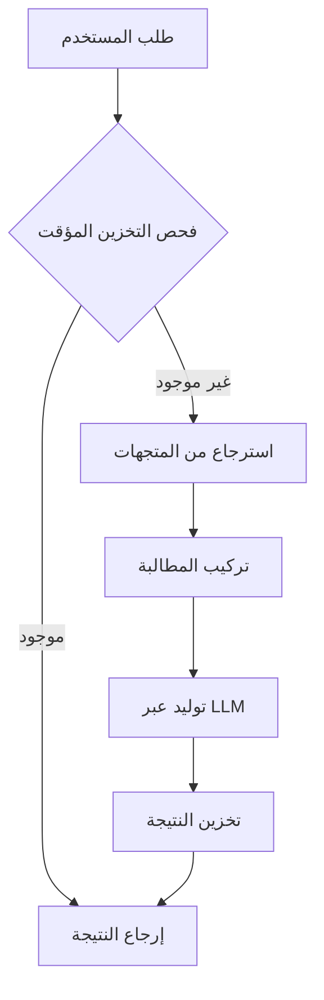

# IRYM SDK: دليل المطور الكامل

مرحباً بك في الدليل التفصيلي لـ IRYM SDK. يغطي هذا الدليل سيناريوهات الاستخدام المحددة وأنماط التكامل لبناء تطبيقات ذكاء اصطناعي جاهزة للإنتاج.

---

## 🛠️ أدلة الخدمات الأساسية

### 1. RAG (توليد المستندات المدعوم بالاسترجاع)
خط إنتاج RAG هو قلب الذكاء المستند إلى المستندات. يدعم أنواع ملفات مختلفة ويعالج نسبة المصادر تلقائياً.

```python
from IRYM_sdk import init_irym, startup_irym, get_rag_pipeline

async def run_rag():
    init_irym()
    await startup_irym()
    # الاستعاب من مصادر متعددة
    await rag.ingest("./docs/")             # ملفات (PDF, MD, TXT, DOCX, XLSX)
    await rag.ingest_url("https://ai.com")  # كاشط الويب
    
    # جديد: استيعاب متقدم
    await rag.ingest_sql(
        connection_string="sqlite:///data.db",
        query="SELECT content, author FROM posts",
        text_column="content"
    )
    
    await rag.ingest_api(
        url="https://api.service.com/v1/news",
        data_path="results.items"
    )
    
    # الاستعلام مع الاستشهادات
    response = await rag.query("كيف يمكنني تكوين مخزن المتجهات؟")
    print(response) # "يمكنك تكوينه في config.py... [المصدر: config.py]"
```

### 2. خدمة الصوت (STT & TTS)
تعامل مع التفاعلات الصوتية باستخدام نماذج محلية أو سحابية.

#### 🎙️ الخدمة المحلية
```python
from IRYM_sdk.audio.local import LocalAudioService
audio = LocalAudioService()
await audio.init()
text = await audio.stt("input.wav")
```

#### ☁️ خدمة OpenAI / السحابية
```python
from IRYM_sdk.audio.openai import OpenAISTT, OpenAITTS
stt = OpenAISTT()
tts = OpenAITTS()
await stt.init()
text = await stt.transcribe("voice.mp3")
```

### 3. خدمة الرؤية (VLM)
قم بتحليل الصور باستخدام نماذج رؤية محلية أو متوافقة مع OpenAI. يعالج خط الإنتاج المتكامل **التخزين المؤقت** و**سياق الـ RAG** تلقائياً.

```python
from IRYM_sdk import init_irym_full, get_vlm_pipeline

async def vision_demo():
    await init_irym_full()
    vlm = get_vlm_pipeline()
    
    # تكامل في 3 أسطر: النموذج + التخزين المؤقت + سياق RAG
    answer = await vlm.ask(
        prompt="صف محتويات هذا الرسم العلمي.", 
        image_path="diagram.jpg",
        use_rag=True
    )
    print(answer)
```

### التبديل التلقائي والتأكيد (Service Fallback)
يعطي IRYM SDK الأولوية لمزوديك الأساسيين (OpenAI) ولكنه يتضمن تبديلاً قوياً للموديلات المحلية (Ollama).

افتراضياً، يتبع SDK مبدأ **السلامة أولاً**: سيطلب منك التأكيد في الوحدة الطرفية (terminal) قبل بدء تشغيل موديل محلي لتجنب الاستخدام غير المتوقع.

لتغيير هذا السلوك للإنتاج أو البيئات غير التفاعلية:
```bash
# .env
AUTO_ACCEPT_FALLBACK=true  # التبديل تلقائياً للمحلي دون سؤال
```

---

## 🏗️ البنية التحتية المتقدمة

### 🔄 إدارة دورة الحياة (Lifecycle Management)
استخدم `LifecycleManager` لتسجيل المهام التي تعمل عند بدء تشغيل التطبيق أو إغلاقه. هذا مثالي لإدارة اتصالات قاعدة البيانات أو تحميل نماذج الذكاء الاصطناعي الثقيلة مرة واحدة.

```python
from IRYM_sdk.core.lifecycle import lifecycle

async def my_startup_task():
    print("Pre-loading resources...")

lifecycle.on_startup(my_startup_task)

# عند بدء تشغيل تطبيقك:
await lifecycle.startup()
```

### 📊 المراقبة والوضوح (Observability)
تسجيل منظم مدمج لمراقبة خدمات الذكاء الاصطناعي الخاصة بك.

```python
from IRYM_sdk.observability.logger import get_logger
logger = get_logger("my_app")

logger.info("بدء معالجة الذكاء الاصطناعي...")
```

---

## 🧜‍♂️ هندسة النظام

