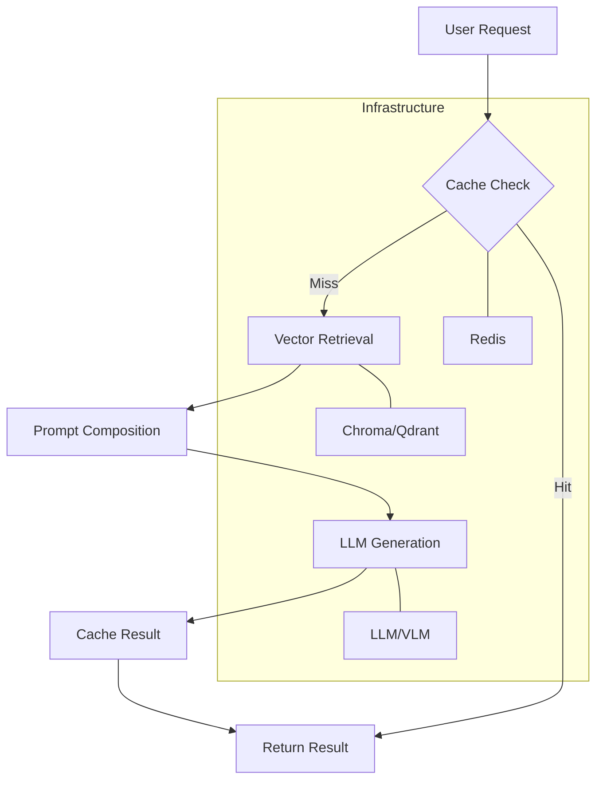

# IRYM SDK: The Complete Developer Guide

Welcome to the deep-dive guide for the IRYM SDK. This guide covers specific usage scenarios and integration patterns for building production AI applications.

---

## 🛠️ Core Service Guides

### 1. RAG (Retrieval Augmented Generation)
The RAG pipeline is the heart of document-based intelligence. It supports various file types and handles source attribution automatically.

```python
from IRYM_sdk import init_irym, startup_irym, get_rag_pipeline

async def run_rag():
    init_irym()
    await startup_irym()
    rag = get_rag_pipeline()
    
    # Ingest from multiple sources
    await rag.ingest("./docs/")
    await rag.ingest_url("https://docs.ai-library.com")
    
    # Query with citations
    response = await rag.query("How do I configure the vector store?")
    print(response) # "You can configure it in config.py... [Source: config.py]"
```

### 2. Audio Service (STT & TTS)
Handle voice interactions with local or cloud-based models.

#### 🎙️ Local Service
```python
from IRYM_sdk.audio.local import LocalAudioService
audio = LocalAudioService()
await audio.init()
text = await audio.stt("input.wav")
```

#### ☁️ OpenAI / Cloud Service
```python
from IRYM_sdk.audio.openai import OpenAISTT, OpenAITTS
stt = OpenAISTT()
tts = OpenAITTS()
await stt.init()
text = await stt.transcribe("voice.mp3")
```

### 3. VLM (Vision Language Models)
Process images and video frames using local or OpenAI-compatible vision models.

```python
from IRYM_sdk.llm.vlm_openai import OpenAI_VLM
vlm = OpenAI_VLM()
answer = await vlm.analyze_image("path/to/image.jpg", "What is happening in this picture?")
```

---

## 🏗️ Advanced Infrastructure

### 🔄 Lifecycle Management
Use the `LifecycleManager` to register hooks that run on application startup or shutdown. This is ideal for managing database pool connections or loading heavy AI models once.

```python
from IRYM_sdk.core.lifecycle import lifecycle

async def my_startup_task():
    print("Pre-loading resources...")

lifecycle.on_startup(my_startup_task)

# When your app starts:
await lifecycle.startup()
```

### 📊 Observability & Logging
Built-in structured logging for monitoring your AI services.

```python
from IRYM_sdk.observability.logger import get_logger
logger = get_logger("my_app")

logger.info("Starting AI processing...")
```

### 🚨 Error Handling
IRYM provides a typed exception hierarchy for robust error catching.

```python
from IRYM_sdk.core.exceptions import IRYMError, ServiceNotInitializedError

try:
    await rag.query("...")
except ServiceNotInitializedError:
    print("Forgot to call init()!")
```

---

## 🌐 Framework Integrations

### ⚡ FastAPI Integration
FastAPI's asynchronous nature is a perfect fit for IRYM. Use the lifecycle hooks for a clean setup.

```python
from fastapi import FastAPI
from IRYM_sdk import init_irym_full # New helper
from IRYM_sdk.core.lifecycle import lifecycle

app = FastAPI()

@app.on_event("startup")
async def startup():
    await init_irym_full() # Initializes config, DI, and runs lifecycle.startup()

@app.on_event("shutdown")
async def shutdown():
    await lifecycle.shutdown()
```

### 🎸 Django Integration
Integrate IRYM into your Django views.

```python
# views.py
from IRYM_sdk import get_rag_pipeline
import asyncio

def ai_chat(request):
    rag = get_rag_pipeline()
    answer = asyncio.run(rag.query(request.GET.get('q')))
    return JsonResponse({"answer": answer})
```

---

## 🧜‍♂️ System Architecture

