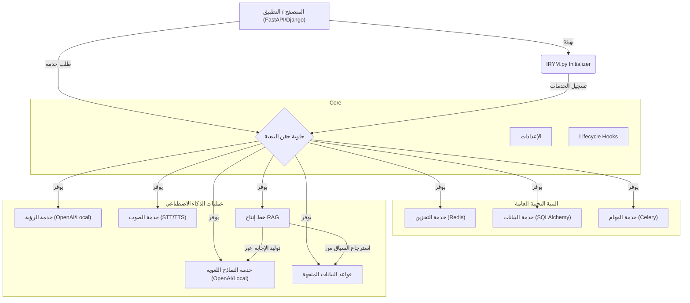

# 🧠 IRYM_sdk (أستطيع قراءة عقلك)

تطوير بنية تحتية برمجية (SDK) جاهزة للإنتاج، مصممة لخدمات الذكاء الاصطناعي المبنية بلغة بايثون.

سواء كنت تبني باستخدام FastAPI أو Django أو أي خدمة مخصصة، فإن **IRYM_sdk** يزيل عنك عناء الإعدادات المتكررة. يوفر نظاماً موحداً وقابلاً للتبديل للتخزين المؤقت (Caching)، الوصول لقواعد البيانات، المهام الخلفية، دمج نماذج اللغة (LLM)، قواعد البيانات المتجهة (Vector DB)، وخطوط إنتاج الـ RAG.

## 🏗️ تدفق الهندسة المعمارية

تم بناء الـ SDK بالكامل حول فلسفة **"كل شيء كخدمة"** و **"الواجهة أولاً"**. يتم إدارة الخدمات مركزياً بواسطة نظام حقن التبعية (Dependency Injection)، مما يضمن نمطية كاملة وتجنب تضارب الحالات العالمية.



## 🚀 المتطلبات الرئيسية والميزات

1. **حقن التبعية (DI)**: سجل مركزي موحد للخدمات.
2. **الواجهة أولاً**: كل وحدة تلتزم بعقد أساسي غير متزامن.
3. **قواعد بيانات متجهة مرنة**: دعم أصلي لـ **ChromaDB** و **Qdrant**.
4. **تضمينات مدمجة**: مهيأة مسبقاً مع `sentence-transformers` لتوليد التضمينات محلياً.
5. **تنسيق RAG**: نظام `RAGPipeline` شامل يعالج تحميل المستندات (.pdf, .docx, .xlsx)، قواعد بيانات SQL، واجهات البرمجة الخارجية (APIs)، وكشط الويب.

## 📦 التثبيت

### 1. نسخ المستودع (Clone)
قم بنسخ المستودع وتثبيت التبعيات:

```bash
git clone https://github.com/blackeagle686/IRYM_sdk.git
cd IRYM_sdk
pip install -r requirements.txt
```

### 2. تثبيت Pip محلي (اختياري)
إذا كنت ترغب في تثبيته كحزمة في بيئتك المحلية:
```bash
pip install .
```

## 📖 التشغيل السريع: RAG Pipeline

نظام `RAGPipeline` هو أعلى مستوى خدمة للتعامل مع المعرفة القائمة على المستندات.

```python
import asyncio
from IRYM_sdk import init_irym, startup_irym, get_rag_pipeline

async def rag_demo():
    init_irym()
    await startup_irym()
    rag = get_rag_pipeline()

    # 1. استيعاب المستندات (يدعم .txt, .md, .pdf, .docx, .csv, .json)
    await rag.ingest("./my_knowledge_base")

    # 2. استيعاب من رابط ويب
    await rag.ingest_url("https://example.com/docs/api")

    # 3. الاستعلام مع استشهادات تلقائية
    answer = await rag.query("ما هي خطط التسعير؟")
    print(f"إجابة الذكاء الاصطناعي: {answer}")
```

## 🖼️ التشغيل السريع: الرؤية (VLM)

يقوم `VLMPipeline` بتنسيق مهام الرؤية مع التخزين المؤقت التلقائي و RAG.

```python
from IRYM_sdk import init_irym_full, get_vlm_pipeline

async def vision_demo():
    await init_irym_full()
    vlm = get_vlm_pipeline()

    # متكامل: تخزين النتائج + حقن سياق RAG
    answer = await vlm.ask("ماذا يوجد في هذه الصورة؟", "image.png", use_rag=True)
    print(answer)
```
