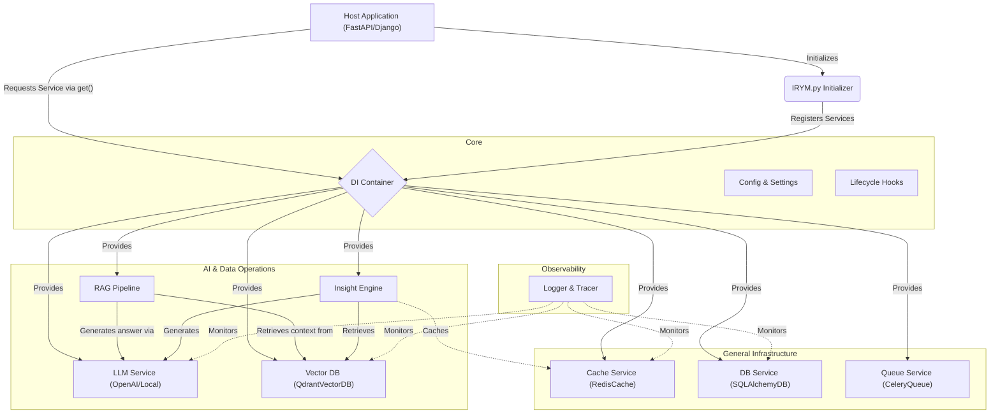

# 🧠 IRYM_sdk (I can Read Your Mind SDK)

A production-ready, modular backend infrastructure SDK designed for AI-powered Python backend services. 

Whether you are building with FastAPI, Django, or a custom event-driven service, **IRYM_sdk** eliminates repetitive backend setup. It provides a unified, interchangeable system for caching, database access, background jobs, LLM integrations, vector databases, and RAG pipelines.

## 🏗️ Architecture Flow

The entire SDK is built around an **Everything is a Service** and **Interface-First** philosophy. Services are centrally managed by a Dependency Injection (DI) system, ensuring complete modularity and avoiding global state collision.



## 🚀 Key Requirements & Core Features

1. **Dependency Injection**: Central standard registry. No manual instantiation inside business logic.
2. **Interface First**: Every module complies with an asynchronous base contract (`BaseCache`, `BaseLLM`, `BaseVectorDB`, etc.).
3. **Insight Layer**: A core AI orchestration engine (`InsightEngine`) handles prompt building, fast caching, vector reranking, and generation seamlessly.
4. **Async-first**: Built iteratively to support high-throughput `asyncio` ecosystems.
5. **Clean AI Architecture**: Combines language models and vector environments effortlessly into `RAGPipeline` implementations.

## 📦 Installation

Since `IRYM_sdk` is designed as an internal core infrastructure layer for your Python applications:

1. **Clone or Copy** the `IRYM_sdk` folder directly into your project's root.
2. **Install Dependencies**: Ensure your environment has the foundational integration libraries installed:
   ```bash
   pip install redis redis[asyncio] sqlalchemy celery pydantic qdrant-client openai
   ```
3. **Configure Environment Variables** (usually via `.env`):
   ```env
   REDIS_URL="redis://localhost:6379"
   OPENAI_API_KEY="sk-xxxx"
   QDRANT_URL="http://localhost:6333"
   ```

## 📖 Quickstart & Basic Usage

Easily invoke and orchestrate `IRYM_sdk` inside any framework like FastAPI or Django:

```python
from fastapi import FastAPI
from IRYM_sdk import init_irym
from IRYM_sdk.core.container import container

app = FastAPI()

# 1. Initialize and register SDK services into the DI Container
init_irym()

@app.get("/test")
async def test():
    # 2. Retrieve decoupled instances without state management overhead
    cache = container.get("cache")
    llm = container.get("llm")
    
    # Optional: init async hooks where necessary depending on implementations
    await cache.init()
    await llm.init()
    
    # 3. Use abstract base methods without worrying about inner details
    await cache.set("hello", {"msg": "world"}, ttl=60)
    cached_val = await cache.get("hello")
    
    response = await llm.generate("Hello world!")
    
    return {
        "cache_result": cached_val,
        "llm_response": response
    }
```

## 🧠 Advanced Usage: Insight Engine

The `InsightEngine` performs full context retrieval, query rewriting, and LLM generation efficiently.

```python
import asyncio
from IRYM_sdk import init_irym
from IRYM_sdk.core.container import container
from IRYM_sdk.insight.engine import InsightEngine


async def insight_demo():
    # Setup Container & Retrieve Services
    init_irym()
    cache = container.get("cache")
    llm = container.get("llm")
    vector_db = container.get("vector_db")

    # Start services (e.g., open async pools)
    await cache.init()
    await llm.init()
    await vector_db.init()

    # Mount the Insight Engine
    # (Caching is optional but drastically improves latency for repeat queries)
    insight = InsightEngine(vector_db=vector_db, llm=llm, cache=cache)

    question = "Who contributed to the containerization architecture?"
    
    # This automatically invokes cache check -> vector retrieval -> prompt building -> generation
    final_response = await insight.query(question)
    print(final_response)

if __name__ == "__main__":
    asyncio.run(insight_demo())
```
