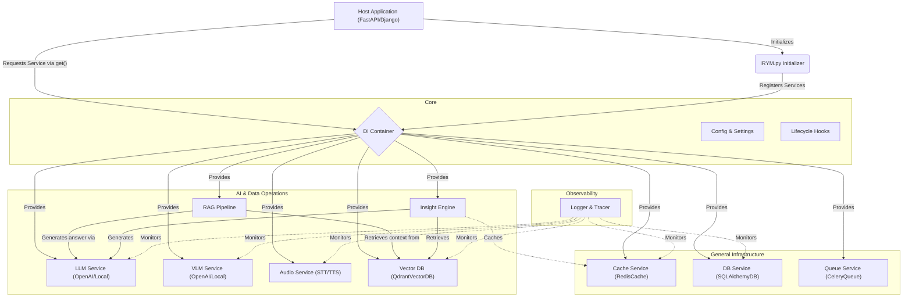

# 🧠 IRYM_sdk (I can Read Your Mind SDK)

A production-ready, modular backend infrastructure SDK designed for AI-powered Python backend services. 

Whether you are building with FastAPI, Django, or a custom event-driven service, **IRYM_sdk** eliminates repetitive backend setup. It provides a unified, interchangeable system for caching, database access, background jobs, LLM integrations, vector databases, and RAG pipelines.

## 🏗️ Architecture Flow

The entire SDK is built around an **Everything is a Service** and **Interface-First** philosophy. Services are centrally managed by a Dependency Injection (DI) system, ensuring complete modularity and avoiding global state collision.



## 🚀 Key Requirements & Core Features

1. **Dependency Injection**: Central standard registry. No manual instantiation inside business logic.
2. **Interface First**: Every module complies with an asynchronous base contract (`BaseCache`, `BaseLLM`, `BaseVectorDB`, etc.).
3. **Flexible Vector DB**: Native support for **ChromaDB** (Default/Persistent) and **Qdrant**.
4. **Embedded Insights**: Pre-configured with `sentence-transformers` (`all-MiniLM-L6-v2`) for local embedding generation.
5. **RAG Orchestration**: All-in-one `RAGPipeline` that handles document loading (.pdf, .docx, .xlsx), SQL databases, external APIs, and web scraping.

## 📦 Installation

### 1. Clone the Repository
Clone the repository and install the dependencies:

```bash
git clone https://github.com/blackeagle686/IRYM_sdk.git
cd IRYM_sdk
pip install -r requirements.txt
```

### 2. Local Pip Installation (Optional)
If you want to install it as a package in your local environment:
```bash
# Install core dependencies only
pip install .

# Install with ALL advanced features (Vector DBs, RAG, Redis, etc.)
pip install ".[full]"
```
3. **Configure Environment Variables**:
   ```env
   VECTOR_DB_TYPE="chroma"             # "chroma" or "qdrant"
   CHROMA_PERSIST_DIR="./chroma_db"
   EMBEDDING_MODEL="all-MiniLM-L6-v2"
   ```

## 📖 Quickstart: RAG Pipeline

The `RAGPipeline` is the highest-level service for handling document-based knowledge.

```python
import asyncio
from IRYM_sdk import init_irym, startup_irym, get_rag_pipeline

async def rag_demo():
    init_irym()
    await startup_irym()
    rag = get_rag_pipeline()

    # 1. Ingest documents (Supports .txt, .md, .pdf, .docx, .csv, .json)
    await rag.ingest("./my_knowledge_base")

    # 2. Ingest from Web URL
    await rag.ingest_url("https://example.com/docs/api")

    # 3. Query with automatic Citations
    answer = await rag.query("What are the pricing plans?")
    print(f"AI Answer: {answer}")
```

### 🧠 Source Attribution
The SDK now automatically instructs the LLM to cite its sources. When you query the RAG pipeline, the response will often include markers like `[Source: cloud.pdf]` or `[Source: https://example.com]`.

## 🧠 Advanced Usage: Insight Engine

The `InsightEngine` performs full context retrieval, query rewriting, and LLM generation efficiently.

```python
from IRYM_sdk import init_irym, get_insight_engine

async def insight_demo():
    init_irym()
    insight = get_insight_engine()

    # This invokes: Clean Query -> Vector Search -> Rerank -> LLM Generation
    final_response = await insight.query("How do I extend the cache layer?")
    print(final_response)
```

## 🖼️ Quickstart: VLM (Vision)

The `VLMPipeline` orchestrates vision tasks with automatic caching and RAG.

```python
from IRYM_sdk import init_irym_full, get_vlm_pipeline

async def vision_demo():
    await init_irym_full()
    vlm = get_vlm_pipeline()

    # Integrated: Result Caching + RAG context injection
    answer = await vlm.ask("What is in this image?", "image.png", use_rag=True)
    print(answer)
```
