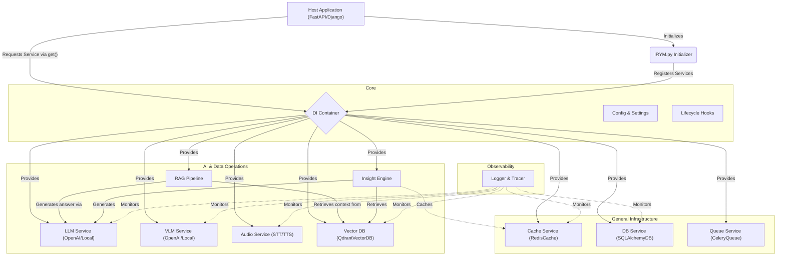

# 🧠 IRYM_sdk (I can Read Your Mind SDK)

A production-ready, modular backend infrastructure SDK designed for AI-powered Python backend services. 

Whether you are building with FastAPI, Django, or a custom event-driven service, **IRYM_sdk** eliminates repetitive backend setup. It provides a unified, interchangeable system for caching, database access, background jobs, LLM integrations, vector databases, and RAG pipelines.

## 🏗️ Architecture Flow

The entire SDK is built around an **Everything is a Service** and **Interface-First** philosophy. Services are centrally managed by a Dependency Injection (DI) system, ensuring complete modularity and avoiding global state collision.



## 🚀 Key Requirements & Core Features

1. **Dependency Injection**: Central standard registry. No manual instantiation inside business logic.
2. **Interface First**: Every module complies with an asynchronous base contract (`BaseCache`, `BaseLLM`, `BaseVectorDB`, etc.).
3. **Flexible Vector DB**: Native support for **ChromaDB** (Default/Persistent) and **Qdrant**.
4. **Embedded Insights**: Pre-configured with `sentence-transformers` (`all-MiniLM-L6-v2`) for local embedding generation.
5. **RAG Orchestration**: All-in-one `RAGPipeline` that handles document loading, chunking, storage, and intelligent retrieval.

## 📦 Installation

1. **Clone or Copy** the `IRYM_sdk` folder directly into your project's root.
2. **Install Dependencies**:
   ```bash
   pip install redis sqlalchemy celery pydantic chromadb sentence-transformers openai
   ```
3. **Configure Environment Variables**:
   ```env
   VECTOR_DB_TYPE="chroma"             # "chroma" or "qdrant"
   CHROMA_PERSIST_DIR="./chroma_db"
   EMBEDDING_MODEL="all-MiniLM-L6-v2"
   ```

## 📖 Quickstart: RAG Pipeline

The `RAGPipeline` is the highest-level service for handling document-based knowledge.

```python
import asyncio
from IRYM_sdk import init_irym, get_rag_pipeline

async def rag_demo():
    init_irym()
    rag = get_rag_pipeline()

    # 1. Ingest documents (Supports folders with .txt, .md, .pdf)
    await rag.ingest("./my_knowledge_base")

    # 2. Query with context
    answer = await rag.query("What are the system requirements?")
    print(f"AI Answer: {answer}")

    # 3. Clear data if needed
    # await rag.clear_data()

if __name__ == "__main__":
    asyncio.run(rag_demo())
```

## 📂 Vector DB Service

You can also use the `VectorDB` service directly for granular control:

```python
from IRYM_sdk.core.container import container

async def vector_crud_demo():
    vdb = container.get("vector_db")
    await vdb.init()

    # Add raw text
    await vdb.add(
        texts=["IRYM SDK supports multiple vector stores."],
        metadatas=[{"category": "info"}],
        ids=["id_001"]
    )

    # Search
    results = await vdb.search("Which vector stores are supported?", limit=2)
    for doc in results:
        print(f"Found: {doc['content']} (Score: {doc['distance']})")

    # Delete
    await vdb.delete(ids=["id_001"])
```

## 🧠 Advanced Usage: Insight Engine

The `InsightEngine` performs full context retrieval, query rewriting, and LLM generation efficiently.

```python
from IRYM_sdk import init_irym, get_insight_engine

async def insight_demo():
    init_irym()
    insight = get_insight_engine()

    # This invokes: Clean Query -> Vector Search -> Rerank -> LLM Generation
    final_response = await insight.query("How do I extend the cache layer?")
    print(final_response)
```
